# 2 - 数学基础

图形学很大程度上就是将数学直接转换成代码。数学越简洁，最终的代码就越清晰；因此本书很大一部分内容专注于为每个任务选择最合适的数学工具。本章回顾了高中和大学数学中的各种工具，设计初衷更多是作为参考资料而非教程。本章看起来可能像是各种主题的大杂烩，事实上也确实如此；选择每个主题都有其原因：要么是因为它在"标准"数学课程中有些不常见，要么是因为它在图形学中具有核心重要性，或者是因为它通常不会从几何角度来讲解。除了建立本书所使用符号记法的回顾之外，本章还强调了一些在标准本科课程中有时会被跳过的要点，例如三角形上的重心坐标。本章并不旨在对这些材料进行严格的理论处理；相反，重点强调直觉理解和几何解释。线性代数的讨论推迟到第6章，就在讨论变换矩阵之前。建议读者浏览本章以熟悉所涵盖的主题，并在需要时回过头来参考。本章末尾的练习题可能有助于确定哪些主题需要复习。

## 2.1 集合和映射

映射（也称为函数）是数学和编程的基础。就像程序中的函数一样，数学中的映射接受某种类型的参数，并将其映射到（返回）特定类型的对象。在程序中，我们称之为"类型"；在数学中，我们会明确指出集合。当我们有一个对象是某个集合的成员时，我们使用符号 $\in$。例如，

$$a \in S$$

可以读作"$a$ 是集合 $S$ 的成员"。给定任意两个集合 $A$ 和 $B$，我们可以通过取两个集合的笛卡尔积来创建第三个集合，记作 $A \times B$。这个集合 $A \times B$ 由所有可能的有序对 $(a,b)$ 组成，其中 $a \in A$ 且 $b \in B$。作为简写，我们使用记号 $A^2$ 来表示 $A \times A$。我们可以扩展笛卡尔积的概念，从三个集合创建所有可能的有序三元组的集合，依此类推，可以从任意多个集合得到任意长度的有序元组。

常用的集合包括：

• $\mathbb{R}$ —— 实数集；
• $\mathbb{R}^+$ —— 非负实数集（包括零）；
• $\mathbb{R}^2$ —— 实数平面上的有序对；
• $\mathbb{R}^n$ —— $n$ 维笛卡尔空间中的点；
• $\mathbb{Z}$ —— 整数集；
• $S^2$ —— 单位球面上的三维点集（$\mathbb{R}^3$ 中的点）。

注意，虽然 $S^2$ 由嵌入在三维空间中的点组成，但它位于可以用两个变量参数化的曲面上，因此可以将其视为二维集合。

映射的记号使用箭头和冒号，例如：

$$f : \mathbb{R} \to \mathbb{Z}$$

可以读作"存在一个名为 $f$ 的函数，它以实数作为输入并将其映射到整数"。这里，箭头前面的集合称为函数的**定义域**，右侧的集合称为**目标集**。计算机程序员可能更习惯以下等价的表述："存在一个名为 $f$ 的函数，它有一个实数参数并返回一个整数"。换句话说，上述集合记号等价于常见的编程记号：

```text
integer f(real) ← 等价于 → f : ℝ → ℤ
```

因此，冒号-箭头记号可以视为一种编程语法。就是这么简单。

点 $f(a)$ 被称为 $a$ 的**像**，而集合 $A$（定义域的一个子集）的像是目标集的子集，它包含 $A$ 中所有点的像。整个定义域的像被称为函数的**值域**。

### 2.1.1 逆映射

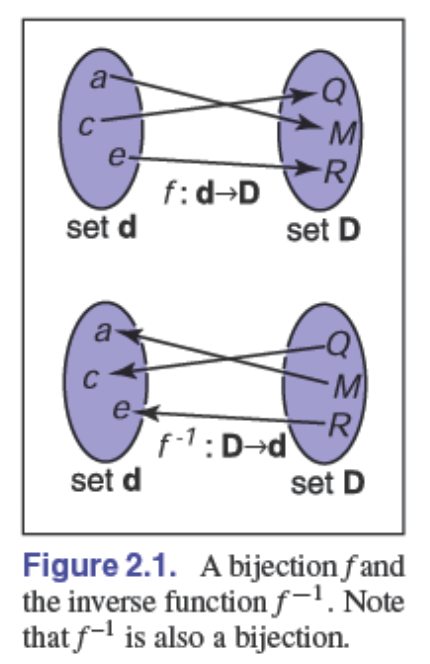
如果我们有一个函数 $f : A \to B$，可能存在一个逆函数 $f^{-1}: B \to A$，其定义规则为 $f^{-1}(b) = a$，其中 $b = f(a)$。这个定义只有在以下条件下才有效：$B$ 中的每个 $b$ 都是某个点在 $f$ 下的像（即值域等于目标集），并且只有唯一的一个这样的点（即只有唯一的 $a$ 使得 $f(a) = b$）。这样的映射或函数被称为**双射**。双射将 $A$ 中的每个 $a$ 映射到 $B$ 中唯一的 $b$，对于 $B$ 中的每个 $b$，都恰好存在一个 $A$ 中的 $a$ 使得 $f(a) = b$（图2.1）。骑手和马匹之间的双射表示每个人都骑一匹马，每匹马都被人骑。这两个函数分别是 rider(horse) 和 horse(rider)。它们互为逆函数。不是双射的函数没有逆函数（图2.2）。
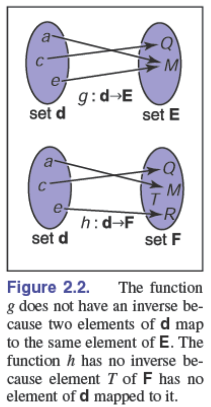
双射的一个例子是 $f : \mathbb{R} \to \mathbb{R}$，其中 $f(x) = x^3$。逆函数是 $f^{-1}(x) = \sqrt[3]{x}$。这个例子表明标准记号可能有些别扭，因为 $x$ 在 $f$ 和 $f^{-1}$ 中都被用作虚拟变量。有时使用不同的虚拟变量会更直观，即 $y = f(x)$ 和 $x = f^{-1}(y)$。这样得到更直观的表示：$y = x^3$ 和 $x = \sqrt[3]{y}$。

没有逆函数的函数例子是 $\text{sqr} : \mathbb{R} \to \mathbb{R}$，其中 $\text{sqr}(x) = x^2$。这有两个原因：首先 $x^2 = (-x)^2$，其次定义域中没有成员映射到目标集的负数部分。注意，如果我们将定义域和值域都限制为 $\mathbb{R}^+$，那么我们可以定义一个逆函数。这时，$\sqrt{x}$ 是一个有效的逆函数。

### 2.1.2 区间

我们经常需要指定函数处理值受限的实数。一种约束方式是指定区间。区间的一个例子是零和一之间的实数，不包括零和一。我们记作 $(0,1)$。因为它不包含端点，这被称为**开区间**。相应的**闭区间**包含其端点，用方括号表示：$[0, 1]$。这种记号可以混合使用；即 $[0, 1)$ 包括零但不包括一。当写区间 $(a, b)$ 时，我们假设 $a \leq b$。表示区间的三种常见方式如图2.3所示。
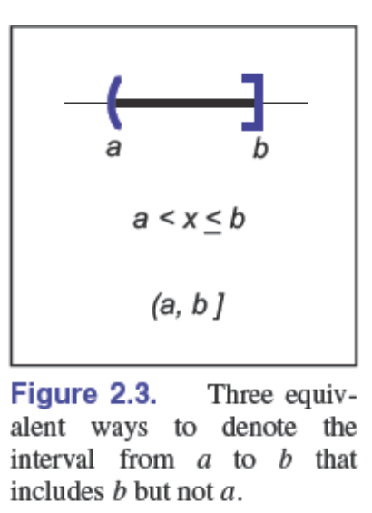
区间的笛卡尔积经常被使用。例如，为了表示点 $x$ 在三维单位立方体中，我们说 $x \in [0, 1]^3$。

区间与集合运算结合使用特别有用：交集、并集和差集。例如，两个区间的交集是它们共有的点的集合。符号 $\cap$ 用于表示交集。例如，$(3, 5) \cap (4, 6] = [4, 5)$。对于并集，符号 $\cup$ 用于表示任一区间中的点。例如，$[3, 5) \cup (4, 6] = [3, 6]$。与前两个运算符不同，差运算符根据参数顺序产生不同的结果。减号用于差运算符，它返回左区间中不在右区间中的点。例如，$[3, 5) - [4, 6] = [3, 4)$ 和 $[4, 6) - [3, 5) = [5, 6)$。使用区间图来可视化这些运算特别容易（图2.4）。
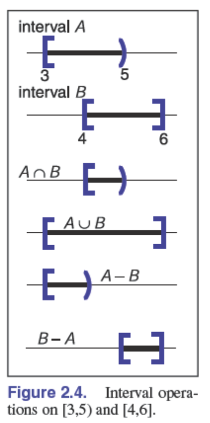

### 2.1.3 对数

尽管对数在今天不如计算器出现之前那样普遍，但在处理含有指数项的方程时，对数仍然很有用。根据定义，每个对数都有一个底数 $a$。"以 $a$ 为底的 $x$ 的对数"写作 $\log_a x$，定义为"$a$ 的多少次幂等于 $x$"，即

$$y = \log_a x \Leftrightarrow a^y = x$$

注意，对数底 $a$ 和将 $a$ 升幂的函数互为逆函数。这个基本定义有几个推论：

$$a^{\log_a x} = x$$

$$\log_a (a^x) = x$$

$$\log_a (xy) = \log_a x + \log_a y$$

$$\log_a (x/y) = \log_a x - \log_a y$$

$$\log_a x = \frac{\log_b x}{\log_b a}$$

当我们将微积分应用于对数时，特殊数字 $e = 2.718\ldots$ 经常出现。以 $e$ 为底的对数称为**自然对数**。我们采用常见的简记 $\ln$ 来表示它：

$$\ln x = \log_e x$$

注意，"$\equiv$" 符号可以读作"根据定义等价于"。与虚数单位 $i$ 一样，特殊数字 $e$ 在大量的上下文中出现。许多领域除了 $e$ 之外还使用特定的底数进行运算，并在记号中省略底数，即 $\log x$。例如，天文学家经常使用以10为底的对数，理论计算机科学家经常使用以2为底的对数。由于计算机图形学借鉴了许多领域的技术，我们将避免使用这种简记。

对数和指数的导数说明了为什么自然对数是"自然的"：

$$\frac{d}{dx} \log_a x = \frac{1}{x \ln a}$$

$$\frac{d}{dx} a^x = a^x \ln a$$

上述常数乘数只有当 $a = e$ 时才等于1。

## 2.2 解二次方程

一元二次方程的形式为

$$Ax^2 + Bx + C = 0,$$

其中 $x$ 是实数未知数，$A$、$B$ 和 $C$ 是已知常数。如果你考虑二维 $xy$ 图，其中 $y = Ax^2 + Bx + C$，解就是 $y$ 的"零点"对应的 $x$ 值。因为 $y = Ax^2 + Bx + C$ 是一条抛物线，根据抛物线与 $x$ 轴相离、相切或相交的情况，将有零个、一个或两个实数解（图2.5）。
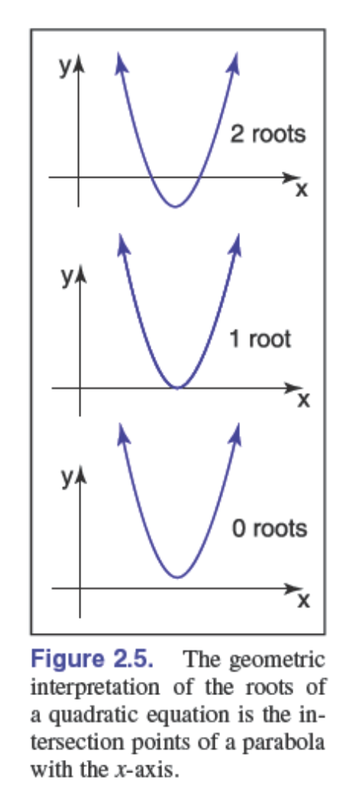
为了解析求解二次方程，我们首先除以 $A$：

$$x^2 + \frac{B}{A}x + \frac{C}{A} = 0$$

然后，我们"配方"来组合项：

$$\left(x + \frac{B}{2A}\right)^2 = \frac{B^2}{4A^2} - \frac{C}{A}$$

将常数项移到右边并开方得到：

$$x + \frac{B}{2A} = \pm\sqrt{\frac{B^2}{4A^2} - \frac{C}{A}}$$

两边减去 $\frac{B}{2A}$ 并将分母为 $2A$ 的项合并，得到熟悉的形式：

$$x = \frac{-B \pm \sqrt{B^2 - 4AC}}{2A} \quad (2.1)$$

这里，"$\pm$" 符号表示有两个解，一个取正号，一个取负号。因此，$3 \pm 1$ 等于"2或4"。注意，决定实数解个数的项是

$$D = B^2 - 4AC,$$

它被称为二次方程的**判别式**。如果 $D > 0$，有两个实数解（也称为根）。如果 $D = 0$，有一个实数解（"重根"）。如果 $D < 0$，没有实数解。

例如，$2x^2 + 6x + 4 = 0$ 的根是 $x = -1$ 和 $x = -2$，而方程 $x^2 + x + 1 = 0$ 没有实数解。这些方程的判别式分别是 $D = 4$ 和 $D = -3$，因此我们预期得到相应数量的解。

在程序中，通常最好先计算 $D$，如果 $D$ 为负，则在不开方的情况下返回"无根"。

## 2.3 三角学

### 2.3.1 角

尽管我们对角度有些习以为常，但我们应该回到角度的定义，以便将角度的概念扩展到球面上。角度是由两条半直线（从原点发出的无限射线）或方向形成的，必须使用某种约定来决定它们之间形成的两个可能角度，如图2.6所示。角度由它在单位圆上截取的弧段长度来定义。一种常见的约定是使用较小的弧长，角度的符号由指定两条半直线的顺序决定。使用这种约定，所有角度都在范围 $[-\pi, \pi]$ 内。

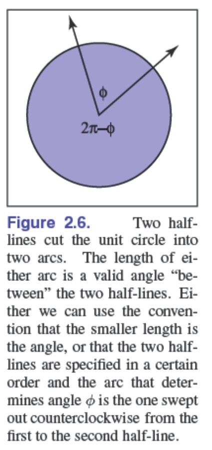

这些角度中的每一个都是两个方向"截取"的单位圆弧的长度。因为单位圆的周长是 $2\pi$，两个可能的角度之和为 $2\pi$。这些弧长的单位是**弧度**。另一个常见的单位是**度**，其中圆的周长是 $360°$。因此，$\pi$ 弧度的角度是 $180°$，通常记作 $180°$。度和弧度之间的转换是：

$$\text{度} = \frac{180}{\pi} \cdot \text{弧度}$$

$$\text{弧度} = \frac{\pi}{180} \cdot \text{度}$$

### 2.3.2 三角函数

给定一个直角三角形，其边长分别为 $a$、$o$ 和 $h$，其中 $h$ 是最长边的长度（总是与直角相对），即斜边，一个重要的关系由**勾股定理**描述：

$$a^2 + o^2 = h^2$$

从图2.7可以看出这是正确的，其中大正方形的面积为 $(a+o)^2$，四个三角形的总面积为 $2ao$，中心正方形的面积为 $h^2$。因为三角形和内部正方形均匀地细分了大正方形，我们有 $2ao + h^2 = (a + o)^2$，这很容易操作为上述形式。
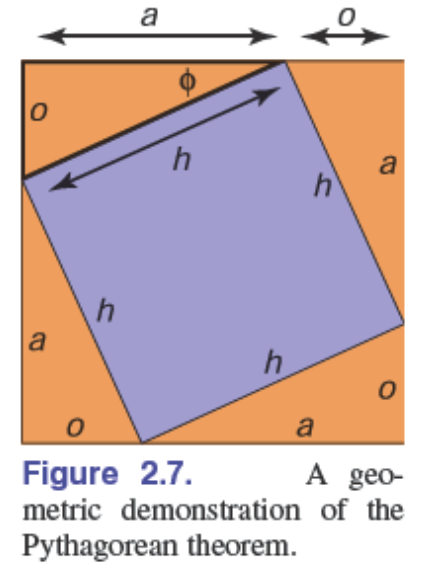
我们定义角 $\phi$ 的正弦和余弦，以及其他基于比值的三角函数表达式：

$$\sin \phi = \frac{o}{h}; \quad \csc \phi = \frac{h}{o};$$

$$\cos \phi = \frac{a}{h}; \quad \sec \phi = \frac{h}{a};$$

$$\tan \phi = \frac{o}{a}; \quad \cot \phi = \frac{a}{o}.$$

这些定义允许我们建立**极坐标系**，其中一个点由距离原点的距离和相对于正 $x$ 轴的有符号角度表示（图2.8）。注意约定角度在范围 $\theta \in (-\pi, \pi]$ 内，正角度是从正 $x$ 轴逆时针方向。这种逆时针对应正数的约定是任意的，但在图形学的许多场合都会使用，所以值得记住。
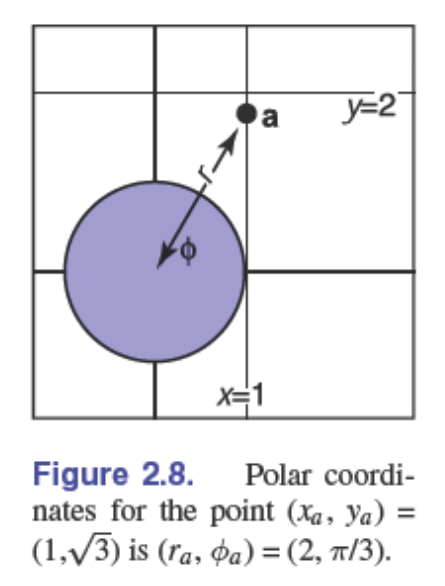
三角函数是周期性的，可以接受任何角度作为参数。例如，$\sin(A) = \sin(A + 2\pi)$。这意味着当考虑定义域为 $\mathbb{R}$ 时，这些函数不可逆。通过限制标准反函数的值域来避免这个问题，这在几乎所有现代数学库中都以标准方式完成（例如，Plauger (1991)）。定义域和值域为：

$$\arcsin : [-1, 1] \rightarrow [-\pi/2, \pi/2];$$

$$\arccos : [-1, 1] \rightarrow [0, \pi]; \quad (2.2)$$

$$\arctan : \mathbb{R} \rightarrow (-\pi/2, \pi/2);$$

$$\text{atan2} : \mathbb{R}^2 \rightarrow (-\pi, \pi].$$

最后一个函数 $\text{atan2}(s, c)$ 通常非常有用。它接受一个与 $\sin A$ 成比例的 $s$ 值和一个按相同因子缩放 $\cos A$ 的 $c$ 值，并返回 $A$。假设该因子为正。理解这个函数的一种方式是，它返回二维笛卡尔坐标点 $(s, c)$ 在极坐标中的角度（图2.9）。
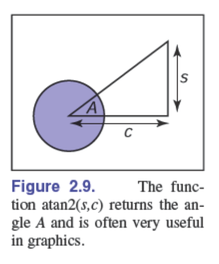

### 2.3.3 常用的等式

#### 位移恒等式（Shifting identities）

$$\sin(-A) = -\sin A$$

$$\cos(-A) = \cos A$$

$$\tan(-A) = -\tan A$$

$$\sin(\pi/2 - A) = \cos A$$

$$\cos(\pi/2 - A) = \sin A$$

$$\tan(\pi/2 - A) = \cot A$$

#### 勾股恒等式（Pythagorean identities）

$$\sin^2 A + \cos^2 A = 1$$

$$\sec^2 A - \tan^2 A = 1$$

$$\csc^2 A - \cot^2 A = 1$$

#### 加法和减法恒等式（Addition and subtraction identities）

$$\sin(A + B) = \sin A \cos B + \sin B \cos A$$

$$\sin(A - B) = \sin A \cos B - \sin B \cos A$$

$$\sin(2A) = 2\sin A \cos A$$

$$\cos(A + B) = \cos A \cos B - \sin A \sin B$$

$$\cos(A - B) = \cos A \cos B + \sin A \sin B$$

$$\cos(2A) = \cos^2 A - \sin^2 A$$

$$\tan(A + B) = \frac{\tan A + \tan B}{1 - \tan A \tan B}$$

$$\tan(A - B) = \frac{\tan A - \tan B}{1 + \tan A \tan B}$$

$$\tan(2A) = \frac{2\tan A}{1 - \tan^2 A}$$

#### 半角恒等式（Half-angle identities）：

$$\sin^2(A/2) = \frac{1 - \cos A}{2}$$

$$\cos^2(A/2) = \frac{1 + \cos A}{2}$$

#### 任意三角形定律

以下恒等式适用于边长为 $a$、$b$、$c$，对应角度分别为 $A$、$B$、$C$ 的任意三角形（图2.10）：

$$\frac{\sin A}{a} = \frac{\sin B}{b} = \frac{\sin C}{c} \quad \text{（正弦定律）}$$

$$c^2 = a^2 + b^2 - 2ab \cos C \quad \text{（余弦定律）}$$

$$\frac{a + b}{a - b} = \frac{\tan\left(\frac{A+B}{2}\right)}{\tan\left(\frac{A-B}{2}\right)} \quad \text{（正切定律）}$$

#### 三角形面积

三角形的面积也可以用这些边长来计算：

$$\text{三角形面积} = \frac{1}{4}\sqrt{(a + b + c)(-a + b + c)(a - b + c)(a + b - c)}$$

### 2.3.4 立体角和球面三角学

本节中的传统三角学处理的是平面上的三角形。三角形也可以定义在非平面表面上，其中一个在许多领域（例如天文学）中出现的是单位半径球面上的三角形。这些**球面三角形**的边是球面上大圆（单位半径圆）的弧段。对这些三角形的研究被称为**球面三角学**，在图形学中并不常用，但当它出现时，有时是至关重要的。我们不会在这里讨论其细节，但希望读者知道当这些问题确实出现时，存在相应的理论领域，并且有许多有用的规则，如球面余弦定律和球面正弦定律。关于球面三角学机制的应用示例，可参见关于采样三角形光源（投影到球面三角形）的论文 (Arvo, 1995b)。

对计算机图形学更为核心的重要概念是**立体角**。虽然角度允许我们量化诸如"在我的视野中那两根杆子的分离度是多少"这样的问题，但立体角让我们能够量化诸如"那架飞机覆盖了我视野的多少部分"这样的问题。对于传统角度，我们将杆子投影到单位圆上，并测量它们在单位圆上之间的弧长。我们经常处理角度，以至于我们中的许多人可能会忘记这个定义，因为现在对我们来说这一切都是如此直观。立体角同样简单，但它们可能看起来更令人困惑，因为我们大多数人是在成年后才学习它们的。

对于立体角，我们投影"看到"飞机的可见方向，并将其投影到单位球面上，然后测量面积。这个面积就是立体角，就像弧长是角度一样。虽然角度以**弧度**为单位测量，总和为 $2\pi$（单位圆的总长度），立体角以**球面度（steradians）**为单位测量，总和为 $4\pi$（单位球面的总面积）。

## 2.4 向量

**向量**描述长度和方向。它可以有效地用箭头来表示。如果两个向量具有相同的长度和方向，那么它们就是相等的，即使我们认为它们位于不同的位置（图2.11）。你应该尽可能将向量视为箭头，而不是坐标或数字。在某个时刻，我们必须在程序中将向量表示为数字，但即使在代码中，它们也应该作为对象来操作，只有底层的向量运算才需要了解它们的数值表示 (DeRose, 1989)。向量将用粗体字符表示，例如 $\mathbf{a}$。向量的长度记为 $\|\mathbf{a}\|$。**单位向量**是任何长度为1的向量。**零向量**是长度为零的向量。零向量的方向是未定义的。

向量可以用来表示许多不同的事物。例如，它们可以用来存储**偏移量**，也称为**位移**。如果我们知道"宝藏埋在秘密集合地点向东两步、向北三步的地方"，那么我们知道偏移量，但不知道从哪里开始。向量也可以用来存储**位置**，这是**位置**或**点**的另一个词。位置可以表示为相对于另一个位置的位移。通常，有一个约定的原点位置，所有其他位置都作为相对于该原点的偏移量来存储。

需要注意的是，**位置不是向量**。正如我们将要讨论的，你可以将两个向量相加。然而，将两个位置相加通常没有意义，除非它是计算位置加权平均时的中间运算 (Goldman, 1985)。将两个偏移量相加确实有意义，这也是偏移量是向量的一个原因。但这强调了位置不是偏移量；它是相对于特定原点位置的偏移量。偏移量本身并不是位置。

### 2.4.1 向量操作

向量具有我们与实数相关联的大多数常用算术运算。当且仅当两个向量具有相同的长度和方向时，它们才相等。两个向量根据**平行四边形法则**相加。该法则规定，两个向量的和是通过将其中一个向量的尾部放在另一个向量的头部来求得的（图2.12）。和向量是"完成三角形"的向量，该三角形由这两个向量开始形成。平行四边形是通过以任一顺序求和形成的。这强调了向量加法具有**交换律**：

$$\mathbf{a} + \mathbf{b} = \mathbf{b} + \mathbf{a}$$

注意，平行四边形法则只是形式化了我们对位移的直觉。想象沿着一个向量从尾到头走，然后沿着另一个向量走。净位移就是平行四边形的对角线。你也可以为向量创建一个**一元负号**：$-\mathbf{a}$（图2.13）是一个与 $\mathbf{a}$ 长度相同但方向相反的向量。这允许我们也定义减法：

$$\mathbf{b} - \mathbf{a} = -\mathbf{a} + \mathbf{b}$$

你可以用平行四边形来可视化向量减法（图2.14）。我们可以写出：

$$\mathbf{a} + (\mathbf{b} - \mathbf{a}) = \mathbf{b}$$

向量也可以相乘。实际上，有几种涉及向量的乘积。首先，我们可以通过将向量乘以实数 $k$ 来**缩放**向量。这只是改变向量的长度而不改变其方向。例如，$3.5\mathbf{a}$ 是一个与 $\mathbf{a}$ 方向相同的向量，但它的长度是 $\mathbf{a}$ 的3.5倍。我们将在本节后面讨论两种涉及两个向量的乘积：**点积**和**叉积**，以及在第6章中讨论涉及三个向量的乘积：**行列式**。

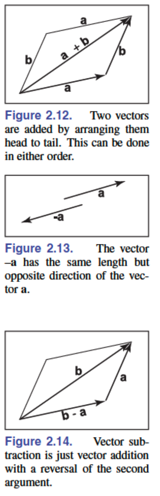

### 2.4.2 笛卡尔坐标系下的向量

一个2D向量可以写成任意两个非零且不平行向量的组合。这两个向量的这种性质称为**线性无关**。两个线性无关的向量构成一个**2D基底**，因此这些向量被称为**基向量**。例如，向量 $\mathbf{c}$ 可以表示为两个基向量 $\mathbf{a}$ 和 $\mathbf{b}$ 的组合（图2.15）：

$$\mathbf{c} = a_c\mathbf{a} + b_c\mathbf{b}\tag{2.3}$$


注意权重 $a_c$ 和 $b_c$ 是唯一的。如果两个向量是**正交的**（即它们彼此成直角），基底就特别有用。如果它们同时也是单位向量，这种情况下它们是**标准正交的**，则更加有用。如果我们假设已知两个这样的"特殊"向量 $\mathbf{x}$ 和 $\mathbf{y}$，那么我们可以用它们在**笛卡尔坐标系**中表示所有其他向量，其中每个向量都用两个实数来表示。例如，向量 $\mathbf{a}$ 可以表示为：

$$\mathbf{a} = x_a\mathbf{x} + y_a\mathbf{y}$$

其中 $x_a$ 和 $y_a$ 是2D向量 $\mathbf{a}$ 的实数笛卡尔坐标（图2.16）。注意这在概念上与方程(2.3)并没有真正的不同，其中基向量不是标准正交的。但笛卡尔坐标系有几个优势。例如，根据**勾股定理**，$\mathbf{a}$ 的长度为：

$$\|\mathbf{a}\| = \sqrt{x_a^2 + y_a^2}$$

在笛卡尔系统中计算点积、叉积和向量坐标也很简单，我们将在后续章节中看到。

按照惯例，我们将 $\mathbf{a}$ 的坐标写成有序对 $(x_a, y_a)$ 或列矩阵的形式：

$$\mathbf{a} = \begin{pmatrix} x_a \\ y_a \end{pmatrix}$$

我们使用哪种形式取决于排版的便利性。我们偶尔也会将向量写成行矩阵，表示为 $\mathbf{a}^T$：

$$\mathbf{a}^T = \begin{pmatrix} x_a & y_a \end{pmatrix}$$

我们也可以用笛卡尔坐标表示3D、4D等向量。对于3D情况，我们使用一个既与 $\mathbf{x}$ 正交又与 $\mathbf{y}$ 正交的基向量 $\mathbf{z}$。

### 2.4.3 点积

两个向量相乘最简单的方式是**点积**。$\mathbf{a}$ 和 $\mathbf{b}$ 的点积记作 $\mathbf{a} \cdot \mathbf{b}$，通常也称为**标量积**，因为它返回一个标量。点积返回一个与其参数的长度和它们之间夹角 $\phi$ 相关的值（图2.17）：

$$\mathbf{a} \cdot \mathbf{b} = \|\mathbf{a}\| \|\mathbf{b}\| \cos \phi \tag{2.4}$$

在图形程序中，点积最常见的用途是计算两个向量之间夹角的余弦值。

点积也可以用来求一个向量在另一个向量上的**投影**。这是向量 $\mathbf{a}$ 垂直投影到向量 $\mathbf{b}$ 上的长度 $a_{\rightarrow b}$（图2.18）：

$$a_{\rightarrow b} = \|\mathbf{a}\| \cos \phi = \frac{\mathbf{a} \cdot \mathbf{b}}{\|\mathbf{b}\|}$$

点积遵循我们在实数算术中熟悉的结合律和分配律：

$$\begin{align}
\mathbf{a} \cdot \mathbf{b} &= \mathbf{b} \cdot \mathbf{a} \\
\mathbf{a} \cdot (\mathbf{b} + \mathbf{c}) &= \mathbf{a} \cdot \mathbf{b} + \mathbf{a} \cdot \mathbf{c} \\
(k\mathbf{a}) \cdot \mathbf{b} &= \mathbf{a} \cdot (k\mathbf{b}) = k\mathbf{a} \cdot \mathbf{b}
\end{align} \tag{2.6}$$

如果2D向量 $\mathbf{a}$ 和 $\mathbf{b}$ 用笛卡尔坐标表示，我们可以利用 $\mathbf{x} \cdot \mathbf{x} = \mathbf{y} \cdot \mathbf{y} = 1$ 和 $\mathbf{x} \cdot \mathbf{y} = 0$ 来推导出它们的点积为：

$$\begin{align}
\mathbf{a} \cdot \mathbf{b} &= (x_a\mathbf{x} + y_a\mathbf{y}) \cdot (x_b\mathbf{x} + y_b\mathbf{y}) \\
&= x_ax_b(\mathbf{x} \cdot \mathbf{x}) + x_ay_b(\mathbf{x} \cdot \mathbf{y}) + x_by_a(\mathbf{y} \cdot \mathbf{x}) + y_ay_b(\mathbf{y} \cdot \mathbf{y}) \\
&= x_ax_b + y_ay_b
\end{align}$$

类似地，在3D中我们可以得到：

$$\mathbf{a} \cdot \mathbf{b} = x_ax_b + y_ay_b + z_az_b$$

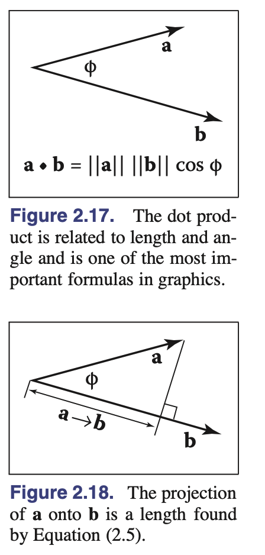

### 2.4.4 叉积

**叉积** $\mathbf{a} \times \mathbf{b}$ 通常仅用于三维向量；广义叉积在本章注释中给出的参考文献中讨论。叉积返回一个垂直于叉积两个参数的3D向量。所得向量的长度与 $\sin \phi$ 相关：

$$\|\mathbf{a} \times \mathbf{b}\| = \|\mathbf{a}\| \|\mathbf{b}\| \sin \phi$$

量值 $\|\mathbf{a} \times \mathbf{b}\|$ 等于由向量 $\mathbf{a}$ 和 $\mathbf{b}$ 形成的**平行四边形的面积**。此外，$\mathbf{a} \times \mathbf{b}$ 既垂直于 $\mathbf{a}$ 也垂直于 $\mathbf{b}$（图2.19）。注意这样的向量只有两个可能的方向。

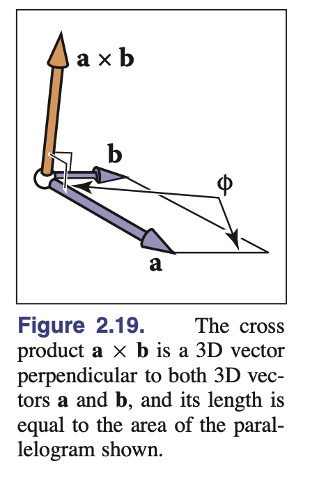

根据定义，$x$、$y$ 和 $z$ 轴方向上的向量为：

$$\begin{align}
\mathbf{x} &= (1, 0, 0) \\
\mathbf{y} &= (0, 1, 0) \\
\mathbf{z} &= (0, 0, 1)
\end{align}$$

我们约定 $\mathbf{x} \times \mathbf{y}$ 必须在正 $z$ 或负 $z$ 方向。这种选择在某种程度上是任意的，但标准做法是假设：

$$\mathbf{z} = \mathbf{x} \times \mathbf{y}$$

三个笛卡尔单位向量的所有可能排列为：

$$\begin{align}
\mathbf{x} \times \mathbf{y} &= +\mathbf{z} \\
\mathbf{y} \times \mathbf{x} &= -\mathbf{z} \\
\mathbf{y} \times \mathbf{z} &= +\mathbf{x} \\
\mathbf{z} \times \mathbf{y} &= -\mathbf{x} \\
\mathbf{z} \times \mathbf{x} &= +\mathbf{y} \\
\mathbf{x} \times \mathbf{z} &= -\mathbf{y}
\end{align}$$

由于 $\sin \phi$ 的性质，我们也知道一个向量与自身的叉积是零向量，所以 $\mathbf{x} \times \mathbf{x} = \mathbf{0}$，等等。注意叉积**不满足交换律**，即 $\mathbf{x} \times \mathbf{y} \neq \mathbf{y} \times \mathbf{x}$。

细心的观察者会注意到，上述讨论并不能让我们明确地画出笛卡尔坐标轴是如何相互关联的。更具体地说，如果我们把 $\mathbf{x}$ 和 $\mathbf{y}$ 放在人行道上，$\mathbf{x}$ 指向东方，$\mathbf{y}$ 指向北方，那么 $\mathbf{z}$ 是指向天空还是指向地面？通常的约定是让 $\mathbf{z}$ 指向天空。这被称为**右手坐标系**。这个名称来自于记忆方法：用你的右手手掌和手指"抓住" $\mathbf{x}$，然后将其旋转向 $\mathbf{y}$。向量 $\mathbf{z}$ 应该与你的拇指对齐。这在图2.20中有所说明。

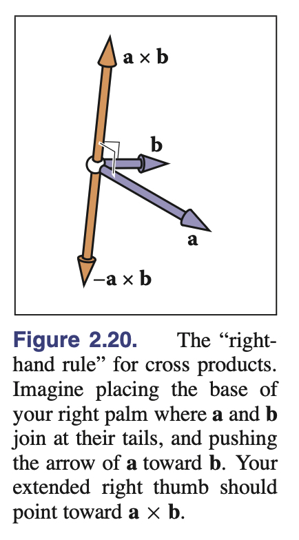

叉积满足分配律：

$$\mathbf{a} \times (\mathbf{b} + \mathbf{c}) = \mathbf{a} \times \mathbf{b} + \mathbf{a} \times \mathbf{c}$$

以及乘数分配律：

$$\mathbf{a} \times (k\mathbf{b}) = k(\mathbf{a} \times \mathbf{b})$$

然而，叉积不满足交换律，右手定则的一个结果是：

$$\mathbf{a} \times \mathbf{b} = -(\mathbf{b} \times \mathbf{a})$$

在笛卡尔坐标系中，我们可以使用显式展开来计算叉积：

$$\begin{align}
\mathbf{a} \times \mathbf{b} &= (x_a\mathbf{x} + y_a\mathbf{y} + z_a\mathbf{z}) \times (x_b\mathbf{x} + y_b\mathbf{y} + z_b\mathbf{z}) \\
&= x_ax_b\mathbf{x} \times \mathbf{x} + x_ay_b\mathbf{x} \times \mathbf{y} + x_az_b\mathbf{x} \times \mathbf{z} \\
&\quad + y_ax_b\mathbf{y} \times \mathbf{x} + y_ay_b\mathbf{y} \times \mathbf{y} + y_az_b\mathbf{y} \times \mathbf{z} \tag{2.7} \\
&\quad + z_ax_b\mathbf{z} \times \mathbf{x} + z_ay_b\mathbf{z} \times \mathbf{y} + z_az_b\mathbf{z} \times \mathbf{z} \\
&= (y_az_b - z_ay_b)\mathbf{x} + (z_ax_b - x_az_b)\mathbf{y} + (x_ay_b - y_ax_b)\mathbf{z}
\end{align}$$

所以，在坐标形式下：

$$\mathbf{a} \times \mathbf{b} = (y_az_b - z_ay_b, z_ax_b - x_az_b, x_ay_b - y_ax_b) \tag{2.8}$$

### 2.4.5 标准正交基和坐标系

管理坐标系是几乎所有图形程序的核心任务之一；其关键在于管理**标准正交基**。任意一组二维向量 $\mathbf{u}$ 和 $\mathbf{v}$ 构成标准正交基，条件是它们正交（成直角）且各自都是单位长度。因此：

$$\|\mathbf{u}\| = \|\mathbf{v}\| = 1$$

并且

$$\mathbf{u} \cdot \mathbf{v} = 0$$

在三维空间中，三个向量 $\mathbf{u}$、$\mathbf{v}$ 和 $\mathbf{w}$ 构成标准正交基，如果：

$$\|\mathbf{u}\| = \|\mathbf{v}\| = \|\mathbf{w}\| = 1$$

并且

$$\mathbf{u} \cdot \mathbf{v} = \mathbf{v} \cdot \mathbf{w} = \mathbf{w} \cdot \mathbf{u} = 0$$

如果满足

$$\mathbf{w} = \mathbf{u} \times \mathbf{v}$$

那么这个标准正交基是**右手的**，否则就是**左手的**。

注意笛卡尔标准标准正交基只是无穷多个可能的标准正交基中的一个。使其特殊的是它和其隐含的原点位置被用于程序内的底层表示。因此，向量 $\mathbf{x}$、$\mathbf{y}$ 和 $\mathbf{z}$ 从不显式存储，标准原点位置 $\mathbf{o}$ 也不存储。全局模型通常存储在这个标准坐标系中，因此它通常被称为**全局坐标系**。

然而，如果我们想使用另一个具有原点 $\mathbf{p}$ 和标准正交基向量 $\mathbf{u}$、$\mathbf{v}$ 和 $\mathbf{w}$ 的坐标系，那么我们需要显式存储这些向量。这样的系统被称为**参考系**或**坐标系**。例如，在飞行模拟器中，我们可能希望维护一个以飞机机头为原点、标准正交基与飞机对齐的坐标系。同时，我们还会有主标准坐标系（图2.21）。与特定对象（如飞机）关联的坐标系通常称为**局部坐标系**。

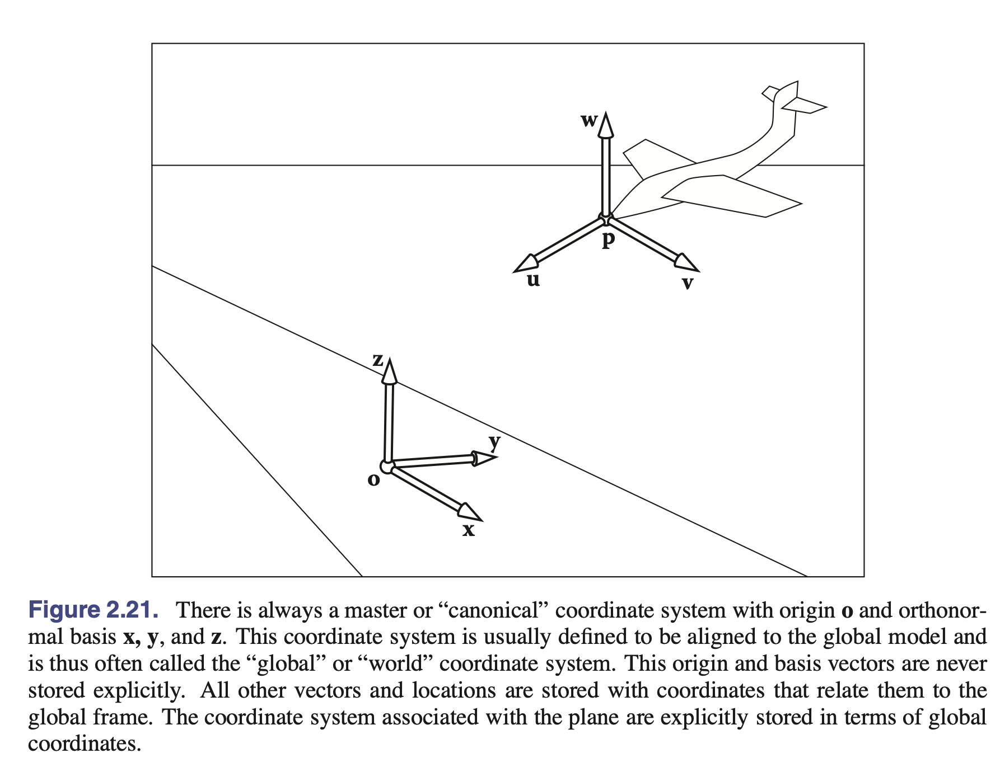

在底层，局部坐标系是以标准坐标存储的。例如，如果 $\mathbf{u}$ 具有坐标 $(x_u, y_u, z_u)$，那么：

$$\mathbf{u} = x_u\mathbf{x} + y_u\mathbf{y} + z_u\mathbf{z}$$

一个位置隐含地包括相对于标准原点的偏移：

$$\mathbf{p} = \mathbf{o} + x_p\mathbf{x} + y_p\mathbf{y} + z_p\mathbf{z}$$

其中 $(x_p, y_p, z_p)$ 是 $\mathbf{p}$ 的坐标。

注意，如果我们相对于 $\mathbf{u}$-$\mathbf{v}$-$\mathbf{w}$ 坐标系存储一个向量 $\mathbf{a}$，我们存储一个三元组 $(u_a, v_a, w_a)$，从几何上可以解释为：

$$\mathbf{a} = u_a\mathbf{u} + v_a\mathbf{v} + w_a\mathbf{w}$$

要获得存储在 $\mathbf{u}$-$\mathbf{v}$-$\mathbf{w}$ 坐标系中的向量 $\mathbf{a}$ 的标准坐标，只需回忆 $\mathbf{u}$、$\mathbf{v}$ 和 $\mathbf{w}$ 本身就是用笛卡尔坐标存储的，因此如果显式计算表达式 $u_a\mathbf{u} + v_a\mathbf{v} + w_a\mathbf{w}$ 就已经是笛卡尔坐标了。

要获得存储在标准坐标系中的向量 $\mathbf{b}$ 的 $\mathbf{u}$-$\mathbf{v}$-$\mathbf{w}$ 坐标，我们可以使用点积：

$$u_b = \mathbf{u} \cdot \mathbf{b}; \quad v_b = \mathbf{v} \cdot \mathbf{b}; \quad w_b = \mathbf{w} \cdot \mathbf{b}$$

这是有效的，因为我们知道对于某些 $u_b$、$v_b$ 和 $w_b$：

$$u_b\mathbf{u} + v_b\mathbf{v} + w_b\mathbf{w} = \mathbf{b}$$

点积可以分离出 $u_b$ 坐标：

$$\begin{align}
\mathbf{u} \cdot \mathbf{b} &= u_b(\mathbf{u} \cdot \mathbf{u}) + v_b(\mathbf{u} \cdot \mathbf{v}) + w_b(\mathbf{u} \cdot \mathbf{w}) \\
&= u_b
\end{align}$$

这是有效的，因为 $\mathbf{u}$、$\mathbf{v}$ 和 $\mathbf{w}$ 是标准正交的。

使用矩阵管理坐标系变换在第6.2.1节和第6.5节中讨论。

### 2.4.6 从单个向量构建基

我们经常需要构建一个与给定向量对齐的标准正交基。也就是说，给定一个向量 $\mathbf{a}$，我们希望找到标准正交向量 $\mathbf{u}$、$\mathbf{v}$ 和 $\mathbf{w}$，使得 $\mathbf{w}$ 指向与 $\mathbf{a}$ 相同的方向（Hughes & Möller, 1999），但我们并不特别关心 $\mathbf{u}$ 和 $\mathbf{v}$ 是什么。一个向量不足以唯一确定答案；我们只需要一个稳健的过程来找到任何一个可能的基。

可以使用叉积来完成这个任务，如下所示。首先使 $\mathbf{w}$ 成为 $\mathbf{a}$ 方向上的单位向量：

$$\mathbf{w} = \frac{\mathbf{a}}{\|\mathbf{a}\|}$$

然后选择任何与 $\mathbf{w}$ 不共线的向量 $\mathbf{t}$，并使用叉积构建垂直于 $\mathbf{w}$ 的单位向量 $\mathbf{u}$：

$$\mathbf{u} = \frac{\mathbf{t} \times \mathbf{w}}{\|\mathbf{t} \times \mathbf{w}\|}$$

如果 $\mathbf{t}$ 与 $\mathbf{w}$ 共线，分母将为零；如果它们几乎共线，结果将具有低精度。找到与 $\mathbf{w}$ 充分不同的向量的简单过程是：从 $\mathbf{t}$ 等于 $\mathbf{w}$ 开始，将 $\mathbf{t}$ 中幅度最小的分量改为1。例如，如果 $\mathbf{w} = (1/\sqrt{2}, -1/\sqrt{2}, 0)$，那么 $\mathbf{t} = (1/\sqrt{2}, -1/\sqrt{2}, 1)$。

一旦获得了 $\mathbf{w}$ 和 $\mathbf{u}$，完成基的构建就很简单：

$$\mathbf{v} = \mathbf{w} \times \mathbf{u}$$

使用这种构建的一个例子是表面着色，其中需要一个与表面法线对齐的基，但绕法线的旋转通常并不重要。

### 2.4.7 从两个向量构建基

上一节中的过程也可以用于绕给定向量的基的旋转很重要的情况。一个常见的例子是为相机构建基：重要的是要有一个向量与相机观察的方向对齐，但相机绕该向量的方向不是任意的，需要以某种方式指定。一旦方向确定下来，基就完全确定了。

完全指定一个坐标系的常见方法是提供两个向量：$\mathbf{a}$（指定 $\mathbf{w}$）和 $\mathbf{b}$（指定 $\mathbf{v}$）。如果已知这两个向量是垂直的，那么通过 $\mathbf{u} = \mathbf{b} \times \mathbf{a}$ 构建第三个向量是一件简单的事情。

为了确保结果基真的是标准正交的，即使输入向量不完全是，建议使用与单向量过程非常相似的程序：

$$\mathbf{w} = \frac{\mathbf{a}}{\|\mathbf{a}\|}$$

$$\mathbf{u} = \frac{\mathbf{b} \times \mathbf{w}}{\|\mathbf{b} \times \mathbf{w}\|}$$

$$\mathbf{v} = \mathbf{w} \times \mathbf{u}$$

实际上，当 $\mathbf{a}$ 和 $\mathbf{b}$ 不垂直时，这个过程也能很好地工作。在这种情况下，$\mathbf{w}$ 将完全按照 $\mathbf{a}$ 的方向构建，而 $\mathbf{v}$ 被选择为在所有垂直于 $\mathbf{w}$ 的向量中最接近 $\mathbf{b}$ 的向量。

如果 $\mathbf{a}$ 和 $\mathbf{b}$ 共线，这个过程就不起作用了。在这种情况下，$\mathbf{b}$ 对于选择垂直于 $\mathbf{a}$ 的哪个方向没有帮助：它垂直于所有这些方向。

在指定相机位置的例子中（第4.3节），我们要构建一个坐标系，使得 $\mathbf{w}$ 平行于相机观察的方向，$\mathbf{v}$ 应该指向相机的顶部。为了使相机保持竖直，我们围绕视线方向构建基，使用正上方向作为参考向量来确定相机绕视线方向的方向。将 $\mathbf{v}$ 设置得尽可能接近正上方，正好符合"保持相机竖直"的直观概念。

### 2.4.8 基的正交化

有时你可能会发现计算中出现的问题是由于本应正交标准的基中混入了误差——例如，由于计算中的舍入误差，或者基以低精度存储在文件中。

可以使用前一节的过程；简单地使用现有的 $\mathbf{w}$ 和 $\mathbf{v}$ 向量重新构建基，将产生一个接近原始基且正交标准的新基。

这种方法对许多应用都很好，但不是最佳的方法。它确实能产生精确正交的向量，对于几乎正交的初始基，结果不会偏离起始点太远。然而，它是非对称的：它"偏爱" $\mathbf{w}$ 胜过 $\mathbf{v}$，$\mathbf{v}$ 胜过 $\mathbf{u}$（其起始值被舍弃）。它选择接近起始基的基，但不能保证选择最接近的正交标准基。当这还不够好时，可以使用SVD（奇异值分解，第5.4.1节）来计算保证最接近原始基的正交标准基。

## 2.5 曲线和曲面

曲线的几何，特别是曲面的几何，在图形学中起着核心作用。在这里我们回顾2D和3D空间中曲线和曲面的基础知识。

### 2.5.1 2D隐式曲线

直观地说，曲线是一组可以在纸上不抬笔连续绘制的点的集合。描述曲线的一种常见方法是使用隐式方程。二维隐式方程的形式为：

$$f(x,y) = 0$$

函数 $f(x,y)$ 返回一个实数值。使该值为零的点 $(x,y)$ 在曲线上，而使该值非零的点不在曲线上。例如，假设 $f(x,y)$ 是：

$$f(x,y) = (x-x_c)^2 + (y-y_c)^2 - r^2 \tag{2.9}$$

其中 $(x_c, y_c)$ 是一个2D点，$r$ 是一个非零实数。如果我们令 $f(x,y) = 0$，满足这个等式的点在以 $(x_c, y_c)$ 为圆心、$r$ 为半径的圆上。这被称为"隐式"方程的原因是曲线上的点 $(x,y)$ 不能从方程中直接计算出来，而是必须通过求解方程来确定。因此，曲线上的点不是由方程显式生成的，而是隐含地蕴藏在方程中的某个地方。

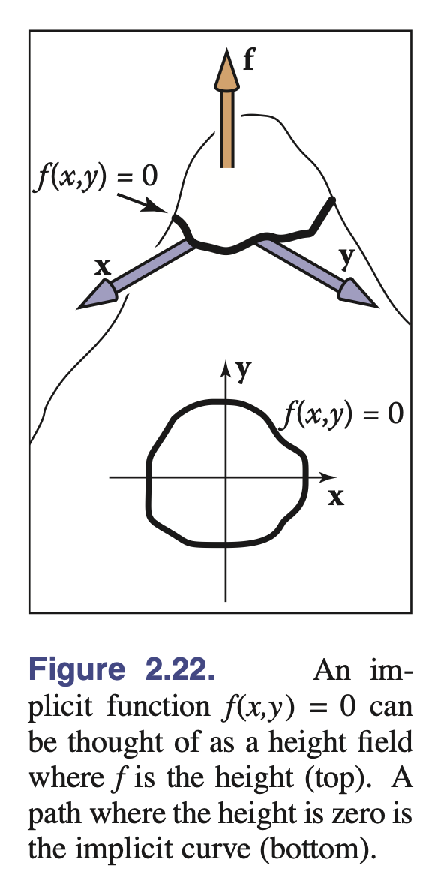

有趣的是，$f$ 对所有的 $(x,y)$ 都有值。我们可以将 $f$ 看作地形，海平面位于 $f = 0$（图2.22）。海岸线就是隐式曲线，$f$ 的值就是海拔高度。另一个需要注意的是，曲线将空间分割为 $f > 0$、$f < 0$ 和 $f = 0$ 的区域。因此，你可以通过计算 $f$ 来判断一个点是否在曲线"内部"。注意对于任何常数 $c$，$f(x,y) = c$ 都是一条曲线，而 $c = 0$ 只是作为约定使用。例如，如果 $f(x,y) = x^2 + y^2 - 1$，改变 $c$ 只会给出以原点为中心的各种圆（图2.23）。

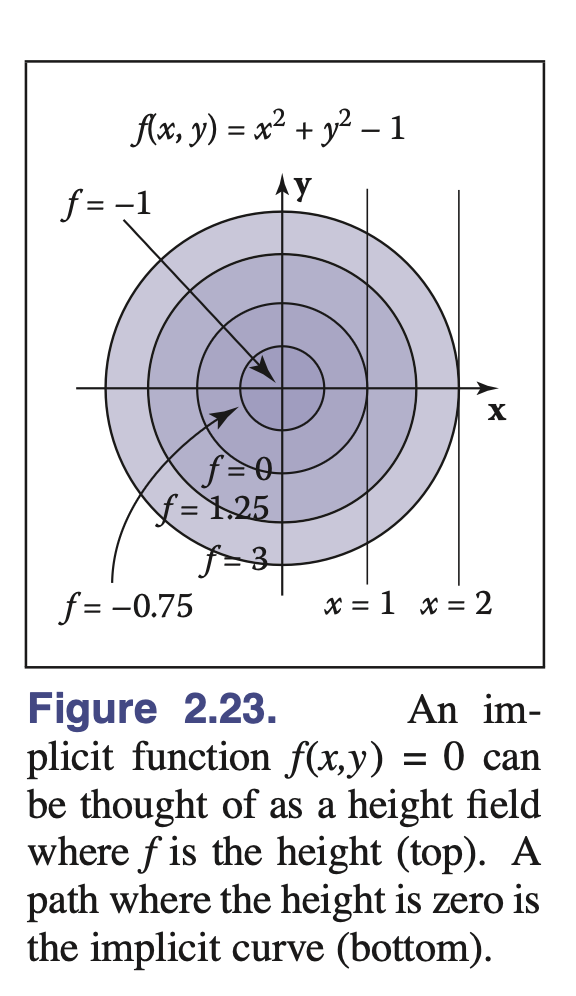

我们可以使用向量来简化表示法。如果我们有 $\mathbf{c} = (x_c, y_c)$ 和 $\mathbf{p} = (x, y)$，那么以 $\mathbf{c}$ 为中心、$r$ 为半径的圆由满足以下条件的位置向量定义：

$$(\mathbf{p} - \mathbf{c}) \cdot (\mathbf{p} - \mathbf{c}) - r^2 = 0$$

这个方程如果代数展开，将得到方程(2.9)，但通过几何"阅读"这个方程更容易看出这是一个圆的方程。它的意思是："圆上的点 $\mathbf{p}$ 具有以下性质：从 $\mathbf{c}$ 到 $\mathbf{p}$ 的向量与自身的点积等于 $r^2$。"因为一个向量与自身的点积就是其长度的平方，我们也可以理解为："圆上的点 $\mathbf{p}$ 具有以下性质：从 $\mathbf{c}$ 到 $\mathbf{p}$ 的向量的长度平方为 $r^2$。"

更好的理解是观察到长度平方就是从 $\mathbf{c}$ 到 $\mathbf{p}$ 的距离平方，这提示了等价形式：

$$\|\mathbf{p} - \mathbf{c}\|^2 - r^2 = 0$$

当然，这进一步提示：

$$\|\mathbf{p} - \mathbf{c}\| - r = 0$$

上式可以理解为"圆上的点 $\mathbf{p}$ 是那些与中心点 $\mathbf{c}$ 距离为 $r$ 的点"，这是圆的最佳定义之一。这说明方程的向量形式通常比等价的完整笛卡尔形式（带有 $x$ 和 $y$）提供更多的几何直观和洞察。因此，通常建议尽可能使用向量形式。此外，你可以在代码中支持向量类；使用向量形式时代码更清晰。面向向量的方程在实现时也更不容易出错：一旦在代码中实现并调试了向量类型，涉及 $x$、$y$ 和 $z$ 的剪切粘贴错误就会消失。习惯在这些方程中使用向量需要一点时间，但一旦掌握，回报是巨大的。

### 2.5.2 2D梯度

如果我们将函数 $f(x,y)$ 看作高度场，其中高度 $= f(x,y)$，那么梯度向量指向最大上坡方向，即直接向上的方向。梯度向量 $\nabla f(x,y)$ 由以下公式给出：

$$\nabla f(x,y) = \left(\frac{\partial f}{\partial x}, \frac{\partial f}{\partial y}\right)$$

在隐式曲线 $f(x,y) = 0$ 上某点处计算的梯度向量垂直于该点处曲线的切向量。这个垂直向量通常称为曲线的法向量。此外，由于梯度指向上坡方向，它指示了 $f(x,y) > 0$ 区域的方向。

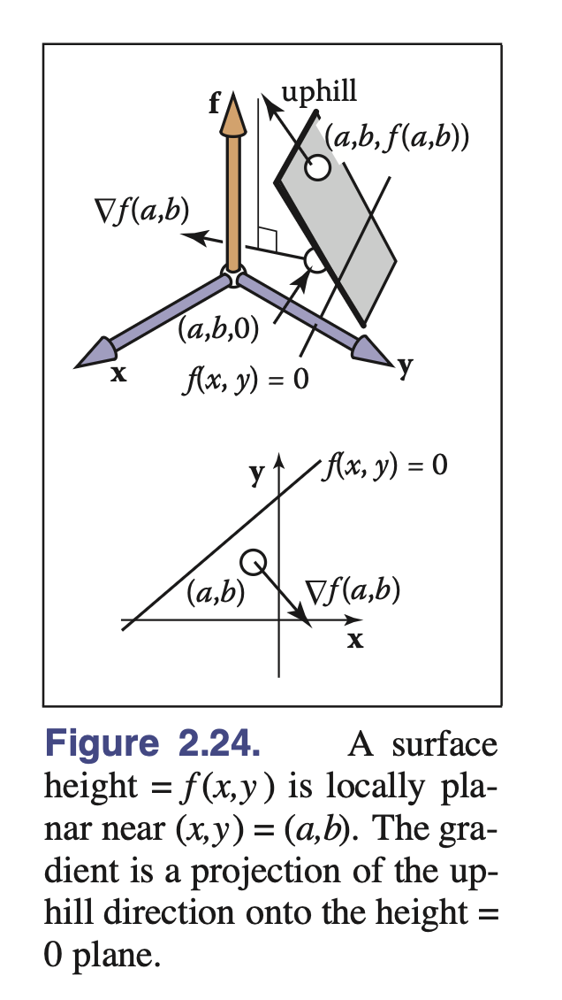

在高度场的背景下，偏导数和梯度的几何意义比平时更加清晰可见。假设在点 $(a,b)$ 附近，$f(x,y)$ 是一个平面（图2.24）。存在特定的上坡和下坡方向。与此方向成直角的是相对于平面水平的方向。平面与 $f(x,y) = 0$ 平面的任何交线都将沿着水平方向。因此，上坡/下坡方向将垂直于交线 $f(x,y) = 0$。要理解偏导数为什么与此相关，我们需要可视化其几何意义。回忆一维函数 $y = g(x)$ 的常规导数是：

$$\frac{dy}{dx} = \lim_{\Delta x \to 0} \frac{\Delta y}{\Delta x} \equiv \lim_{\Delta x \to 0} \frac{g(x+\Delta x) - g(x)}{\Delta x} \tag{2.10}$$

这测量了 $g$ 的切线斜率（图2.25）。

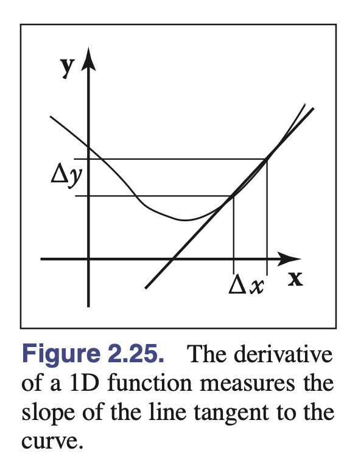

偏导数是一维导数的推广。对于二维函数 $f(x,y)$，我们不能像方程(2.10)那样对 $x$ 取同样的极限，因为对于给定的 $x$ 变化，$f$ 可能以多种方式变化。然而，如果我们保持 $y$ 不变，我们可以定义导数的类比，称为偏导数（图2.26）：

$$\frac{\partial f}{\partial x} \equiv \lim_{\Delta x \to 0} \frac{f(x+\Delta x, y) - f(x, y)}{\Delta x}$$

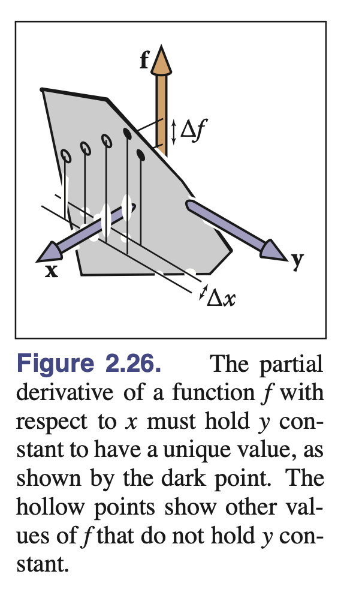

为什么关于 $x$ 和 $y$ 的偏导数是梯度向量的分量？同样，几何直观比代数更容易理解。在图2.27中，我们看到向量 $\mathbf{a}$ 沿着 $f$ 不变的路径移动。注意这里的尺度足够小，使得表面高度 $h(x,y) = f(x,y)$ 可以被认为是局部平面的。从图中我们看到向量 $\mathbf{a} = (\Delta x, \Delta y)$。

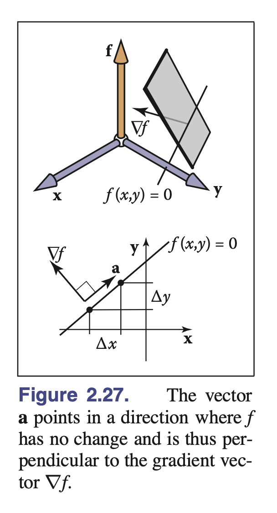

因为上坡方向垂直于 $\mathbf{a}$，我们知道点积等于零：

$$(\nabla f) \cdot \mathbf{a} \equiv (x_{\nabla}, y_{\nabla}) \cdot (x_a, y_a) = x_{\nabla}\Delta x + y_{\nabla}\Delta y = 0 \tag{2.11}$$

我们也知道 $f$ 在方向 $(x_a, y_a)$ 上的变化等于零：

$$\Delta f = \frac{\partial f}{\partial x}\Delta x + \frac{\partial f}{\partial y}\Delta y \equiv \frac{\partial f}{\partial x}x_a + \frac{\partial f}{\partial y}y_a = 0$$

对于任何垂直的向量 $(x,y)$ 和 $(x',y')$，我们知道它们之间的角度是90度，因此它们的点积等于零（回忆点积与两向量间角度的余弦成正比）。因此，我们有 $xx' + yy' = 0$。给定 $(x,y)$，很容易构造与 $(x,y)$ 点积为零的有效向量，最明显的两个是 $(y, -x)$ 和 $(-y, x)$；你可以验证这些向量与 $(x,y)$ 的点积确实为零。这个观察的推广是 $(x,y)$ 垂直于 $k(y, -x)$，其中 $k$ 是任何非零常数。这意味着：

$$(x_a, y_a) = k\left(\frac{\partial f}{\partial y}, -\frac{\partial f}{\partial x}\right) \tag{2.12}$$

结合方程(2.11)和(2.12)得到：

$$(x_{\nabla}, y_{\nabla}) = k'\left(\frac{\partial f}{\partial x}, \frac{\partial f}{\partial y}\right)$$

其中 $k'$ 是任何非零常数。根据定义，"上坡"意味着 $f$ 的正向变化，所以我们希望 $k' > 0$，而 $k' = 1$ 是一个完全合理的约定。

作为梯度的例子，考虑隐式圆 $x^2 + y^2 - 1 = 0$，梯度向量为 $(2x, 2y)$，表明圆的外部是函数 $f(x,y) = x^2 + y^2 - 1$ 的正区域。注意梯度向量的长度可能因隐式方程中的乘数而不同。例如，单位圆可以用 $Ax^2 + Ay^2 - A = 0$ 描述，其中 $A$ 是任何非零数。这条曲线的梯度是 $(2Ax, 2Ay)$。这将垂直于圆，但长度由 $A$ 决定。对于 $A > 0$，法向量将指向圆外；对于 $A < 0$，它将指向圆内。这种从外向到内向的切换是正确的，因为正区域在圆内切换了。从高度场的角度来看，$h = Ax^2 + Ay^2 - A$，圆位于零高度。对于 $A > 0$，圆围绕着一个凹陷；对于 $A < 0$，圆围绕着一个凸起。当 $A$ 变得更负时，凸起的高度增加，但 $h = 0$ 的圆不变。最大上坡方向不变，但坡度增加。梯度的长度反映了坡度程度的这种变化。因此直观地，你可以将梯度的方向理解为指向上坡，其大小衡量坡度有多陡。

#### 隐式2D直线

直线的熟悉"斜率-截距"形式是：

$$y = mx + b \tag{2.13}$$

这可以很容易地转换为隐式形式（图2.28）：

$$y - mx - b = 0 \tag{2.14}$$

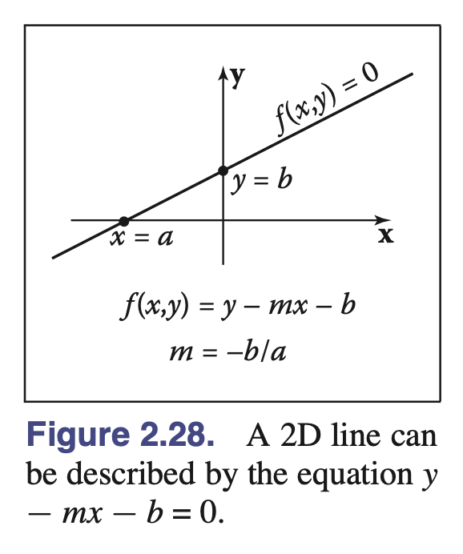

这里 $m$ 是"斜率"（上升与水平距离的比值），$b$ 是直线与 $y$ 轴相交的 $y$ 值，通常称为 $y$ 截距。直线也分割了2D平面，但这里"内部"和"外部"可能更直观地称为"上方"和"下方"。

由于我们可以将隐式方程乘以任何常数而不改变它为零的点，对于任何非零 $k$，$kf(x,y) = 0$ 是相同的曲线。这允许同一条直线有几种隐式形式，例如：

$$2y - 2mx - 2b = 0$$

斜率-截距形式有时不便的一个原因是它不能表示某些直线，如 $x = 0$，因为 $m$ 必须是无穷大。因此，更一般的形式往往有用：

$$Ax + By + C = 0 \tag{2.15}$$

其中 $A$、$B$、$C$ 是实数。

假设我们知道直线上的两个点，$(x_0, y_0)$ 和 $(x_1, y_1)$。什么样的 $A$、$B$、$C$ 描述通过这两个点的直线？因为这些点在直线上，它们都必须满足方程(2.15)：

$$\begin{align}
Ax_0 + By_0 + C &= 0 \\
Ax_1 + By_1 + C &= 0
\end{align}$$

不幸的是，我们有两个方程和三个未知数：$A$、$B$、$C$。这个问题产生是因为隐式方程可以有任意乘数。我们可以为方便起见设 $C = 1$：

$$Ax + By + 1 = 0$$

但我们遇到了与斜率-截距形式中无穷斜率情况类似的问题：通过原点的直线需要满足 $A(0) + B(0) + 1 = 0$，这是矛盾的。例如，通过原点的45度直线的方程可以写成 $x - y = 0$，或同样地 $y - x = 0$，甚至 $17y - 17x = 0$，但它不能写成 $Ax + By + 1 = 0$ 的形式。

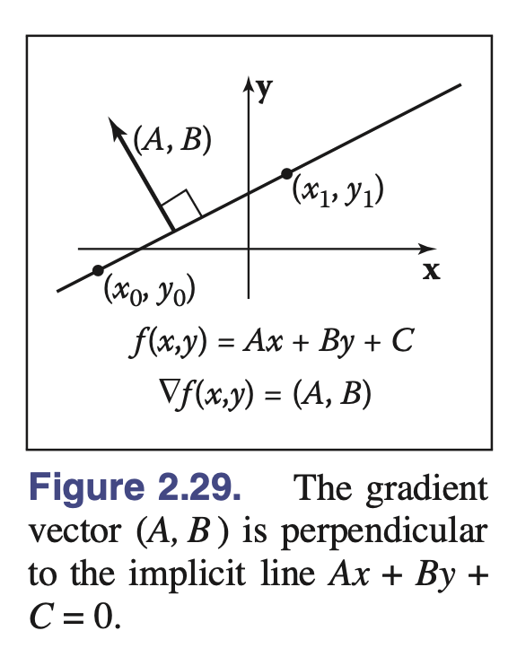

当我们遇到这样讨厌的代数问题时，我们尝试用几何直观作为指导来解决问题。如第2.5.2节所讨论的，我们有的一个工具是梯度。对于直线 $Ax + By + C = 0$，梯度向量是 $(A, B)$。这个向量垂直于直线（图2.29），并指向 $Ax + By + C$ 为正的直线一侧。给定直线上的两个点 $(x_0, y_0)$ 和 $(x_1, y_1)$，我们知道它们之间的向量指向与直线相同的方向。这个向量就是 $(x_1 - x_0, y_1 - y_0)$，因为它平行于直线，所以它也必须垂直于梯度向量 $(A, B)$。回忆由于隐式的任意缩放性质，有无穷多个 $(A, B, C)$ 描述这条直线。我们需要任何一个有效的 $(A, B, C)$。

我们可以从任何垂直于 $(x_1 - x_0, y_1 - y_0)$ 的 $(A, B)$ 开始。根据第2.5.2节中的相同推理，这样的向量就是 $(A, B) = (y_0 - y_1, x_1 - x_0)$。这意味着通过 $(x_0, y_0)$ 和 $(x_1, y_1)$ 的直线方程是：

$$(y_0 - y_1)x + (x_1 - x_0)y + C = 0 \tag{2.16}$$

现在我们只需要找到 $C$。因为 $(x_0, y_0)$ 和 $(x_1, y_1)$ 在直线上，它们必须满足方程(2.16)。我们可以代入任一值并求解 $C$。对 $(x_0, y_0)$ 这样做得到 $C = x_0y_1 - x_1y_0$，因此直线的完整方程是：

$$(y_0 - y_1)x + (x_1 - x_0)y + x_0y_1 - x_1y_0 = 0 \tag{2.17}$$

再次强调，这是通过两点的直线的无穷多个有效隐式方程之一，但这种形式没有除法运算，因此对于有限笛卡尔坐标的点没有数值退化情况。方程(2.17)的一个好处是，当斜率-截距形式存在时，我们总是可以通过将非$y$项移到方程右边并除以$y$项的系数来转换为斜率-截距形式：

$$y = \frac{y_1 - y_0}{x_1 - x_0}x + \frac{x_1y_0 - x_0y_1}{x_1 - x_0}$$

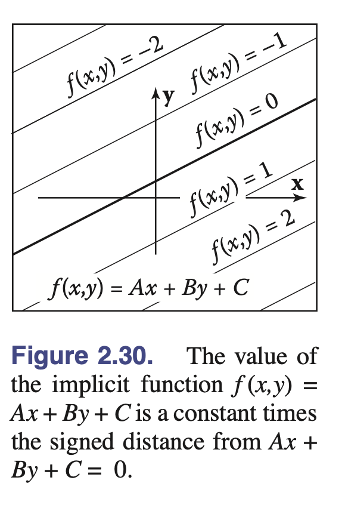

隐式直线方程的一个有趣性质是它可以用来找到从点到直线的有符号距离。$Ax + By + C$的值与到直线的距离成正比（图2.30）。如图2.31所示，从点到直线的距离是向量$k(A,B)$的长度，即：

$$\text{距离} = k\sqrt{A^2 + B^2} \tag{2.18}$$

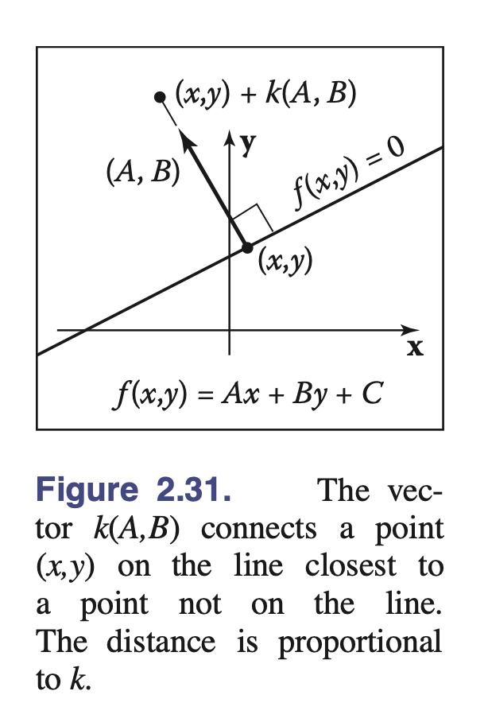

对于点$(x,y) + k(A,B)$，$f(x,y) = Ax + By + C$的值是：

$$\begin{align}
f(x + kA, y + kB) &= Ax + kA^2 + By + kB^2 + C \\
&= k(A^2 + B^2) \tag{2.19}
\end{align}$$

该方程中的简化是由于我们知道$(x,y)$在直线上，所以$Ax + By + C = 0$。从方程(2.18)和(2.19)，我们可以看出从直线$Ax + By + C = 0$到点$(a,b)$的有符号距离是：

$$\text{距离} = \frac{f(a,b)}{\sqrt{A^2 + B^2}}$$

这里"有符号距离"意味着其大小（绝对值）是几何距离，但在直线的一侧，距离是正的，在另一侧是负的。如果你的问题有理由偏好特定一侧为正，你可以在同样有效的表示$f(x,y) = 0$和$-f(x,y) = 0$之间选择。注意如果$(A,B)$是单位向量，那么$f(a,b)$就是有符号距离。我们可以将方程(2.17)乘以一个常数，确保$(A,B)$是单位向量：

$$f(x,y) = \frac{y_0-y_1}{\sqrt{(x_1-x_0)^2 +(y_0-y_1)^2}}x + \frac{x_1-x_0}{\sqrt{(x_1-x_0)^2 +(y_0-y_1)^2}}y + \frac{x_0y_1-x_1y_0}{\sqrt{(x_1-x_0)^2 +(y_0-y_1)^2}} = 0 \tag{2.20}$$

注意直接计算方程(2.20)中的$f(x,y)$给出有符号距离，但建立方程时需要开平方根。隐式直线对三角形光栅化非常有用（第8.1.2节）。2D直线的其他形式在第14章中讨论。

#### 隐式二次曲线

在前一节中，我们看到线性函数$f(x,y)$产生隐式直线$f(x,y) = 0$。如果$f$是关于$x$和$y$的二次函数，其一般形式为：

$$Ax^2 + Bxy + Cy^2 + Dx + Ey + F = 0$$

所得到的隐式曲线称为二次曲线。二维二次曲线包括椭圆和双曲线，以及抛物线、圆和直线的特殊情况。

二次曲线的例子包括以$(x_c, y_c)$为圆心、半径为$r$的圆：

$$(x - x_c)^2 + (y - y_c)^2 - r^2 = 0$$

和轴对齐椭圆，其形式为：

$$\frac{(x - x_c)^2}{a^2} + \frac{(y - y_c)^2}{b^2} - 1 = 0$$

其中$(x_c, y_c)$是椭圆的中心，$a$和$b$是短半轴和长半轴（图2.32）。

### 2.5.3 三维隐式曲面

正如隐式方程可以用来定义二维曲线一样，它们也可以用来定义三维曲面。与二维情况类似，隐式方程隐式地定义了曲面上的点集：

$$f(x,y,z) = 0$$

任何在曲面上的点$(x,y,z)$作为$f$的参数时结果为零。任何不在曲面上的点结果为非零数。你可以通过计算$f$来检查一个点是否在曲面上，或者通过查看$f$的符号来检查点位于曲面的哪一侧，但你不能总是显式地构造曲面上的点。使用向量记号，我们将这种关于$\mathbf{p} = (x,y,z)$的函数写作：

$$f(\mathbf{p}) = 0$$

### 2.5.4 隐式曲面的表面法向量

表面法向量（这是光照计算等所需的）是垂直于表面的向量。表面上的每个点都可能有不同的法向量。就像梯度为二维隐式曲线提供法向量一样，隐式曲面上点$\mathbf{p}$处的表面法向量由隐式函数的梯度给出：

$$\mathbf{n} = \nabla f(\mathbf{p}) = \left(\frac{\partial f(\mathbf{p})}{\partial x}, \frac{\partial f(\mathbf{p})}{\partial y}, \frac{\partial f(\mathbf{p})}{\partial z}\right)$$

推理与二维情况相同：梯度指向$f$增长最快的方向，这垂直于表面的所有切线方向，在这些切线方向上$f$保持常数。梯度向量指向$f(\mathbf{p}) > 0$的表面一侧，在给定上下文中我们可以将其视为"进入"表面或"从表面向外"。

如果$f$的特定形式产生向内的梯度，而需要向外的梯度，那么曲面$-f(\mathbf{p}) = 0$与曲面$f(\mathbf{p}) = 0$相同，但梯度方向相反，即：

$$-\nabla f(\mathbf{p}) = \nabla(-f(\mathbf{p}))$$

### 2.5.5 隐式平面

作为例子，考虑通过点$\mathbf{a}$且表面法向量为$\mathbf{n}$的无限平面。描述该平面的隐式方程为：

$$(\mathbf{p} - \mathbf{a}) \cdot \mathbf{n} = 0 \tag{2.21}$$

注意$\mathbf{a}$和$\mathbf{n}$是已知量。点$\mathbf{p}$是满足方程的任意未知点。在几何意义上，这个方程表示"从$\mathbf{a}$到$\mathbf{p}$的向量垂直于平面法向量"。如果$\mathbf{p}$不在平面内，那么$(\mathbf{p} - \mathbf{a})$不会与$\mathbf{n}$成直角（图2.33）。

有时我们希望得到通过点$\mathbf{a}$、$\mathbf{b}$和$\mathbf{c}$的平面的隐式方程。该平面的法向量可以通过计算平面内任意两个向量的叉积来求得。其中一个这样的叉积是：

$$\mathbf{n} = (\mathbf{b} - \mathbf{a}) \times (\mathbf{c} - \mathbf{a})$$

这使我们能够写出隐式平面方程：

$$(\mathbf{p} - \mathbf{a}) \cdot ((\mathbf{b} - \mathbf{a}) \times (\mathbf{c} - \mathbf{a})) = 0 \tag{2.22}$$

这个方程的几何解读是：由$\mathbf{p} - \mathbf{a}$、$\mathbf{b} - \mathbf{a}$和$\mathbf{c} - \mathbf{a}$定义的平行六面体的体积为零，即它们共面。只有当$\mathbf{p}$与$\mathbf{a}$、$\mathbf{b}$和$\mathbf{c}$在同一平面内时，这才成立。这个方程的完整笛卡尔表示由行列式给出（这在第5.3节中有更详细的讨论）：

$$\begin{vmatrix}
x - x_a & y - y_a & z - z_a \\
x_c - x_a & y_c - y_a & z_c - z_a \\
x_b - x_a & y_b - y_a & z_b - z_a
\end{vmatrix} = 0 \tag{2.23}$$

这个行列式可以展开（参见第5.3节关于行列式展开的方法）为包含许多项的冗长形式。

方程(2.22)和(2.23)是等价的，比较它们很有启发性。方程(2.22)易于几何解释，并能产生高效的代码。此外，如果利用已调试好的叉积和点积代码，相对容易避免编译成错误代码的排版错误。方程(2.23)同样易于几何解释，如果实现了高效的$3 \times 3$行列式函数，它也将是高效的。如果有函数`determinant(a,b,c)`可用，它也容易实现而不会出现拼写错误。如果你将行列式函数重命名为`volume`，其他人阅读你的代码会特别容易。因此，方程(2.22)和(2.23)都能很好地映射到代码中。

将任一方程完全展开为$x$、$y$和$z$分量的形式很可能产生拼写错误。这种拼写错误很可能能够编译通过，因此特别令人困扰。这是简洁数学产生简洁代码而冗长数学产生冗长代码的绝佳例子。

#### 三维二次曲面

正如二变量的二次多项式定义了二维中的二次曲线一样，关于$x$、$y$和$z$的二次多项式定义了三维中的二次曲面。例如，球面可以写为：

$$f(\mathbf{p}) = (\mathbf{p} - \mathbf{c})^2 - r^2 = 0$$

轴对齐的椭球面可以写为：

$$f(\mathbf{p}) = \frac{(x - x_c)^2}{a^2} + \frac{(y - y_c)^2}{b^2} + \frac{(z - z_c)^2}{c^2} - 1 = 0$$

#### 从隐式曲面构造三维曲线

人们可能希望能够用$f(\mathbf{p}) = 0$的形式创建隐式三维曲线。然而，所有这样的曲线都只是退化的曲面，在实践中很少有用。三维曲线可以通过两个同时满足的隐式方程的交集来构造：

$$\begin{cases}
f(\mathbf{p}) = 0 \\
g(\mathbf{p}) = 0
\end{cases}$$

例如，三维直线可以由两个隐式平面的交线形成。通常，使用参数曲线更加方便；它们将在以下章节中讨论。

## 2.9 三角形

2D 三角形面积：$A = \frac{1}{2} \begin{vmatrix} x_b-x_a & x_c-x_a \\ y_b-y_a & y_c-y_a \end{vmatrix}$，abc 三点逆时针排列时 A 为正，反之为负。
2D 三角形内的点：$P = \alpha a+\beta b+ \gamma c\quad where \quad \alpha+\beta+\gamma = 1 \quad  \alpha, \beta, \gamma \lt 1$

> 重心坐标（Barycentric coordinates）和你想的不太一样。。。
> 对于空间三角形 P1P2P3 内任一点 P，必定唯一存在三个数 w1,w2,w3，满足：w1+w2+w3=1
> P=w1*P1+w2*P2+w3\*P3 （即 P 表示成 P1,P2,P3 的线性组合）
> 则(w1,w2,w3)就称为此三角形上 P 点的（归一化）重心坐标（Barycentric coordinates）。

重心坐标的分量越接近 1，表示支点 p 越远离分量的对边。

## 2.12 蒙特卡罗积分

采样，采样得越多计算出来越接近积分真值。

> PDF：probability density function 概率密度函数
> Cumulative Distribution Function, CDF 累计分布函数

### 2.12.1 重要性采样

公式化打法：

1. 确定采样得函数与定义域
2. 确定一个随机生成采样点得算法，同时确定采样点的概率密度函数
3. 计算${f(x_i)}\, / \,{p(x_i)}$的均值

> [!note] 蒙特卡洛积分的正确性说明
> $$E(I) = E\big(\frac{1}{n}\sum_{k=1}^n \frac{f(X_k)}{pdf()X_k}\big)$$ > $$E(I) = \frac{1}{n}\sum_{k=1}^n E\big(\frac{f(X_k)}{pdf()X_k}\big)$$ > $$E(I) = \frac{1}{n}\sum_{k=1}^n E\big(\int \frac{f(x)}{pdf(x)} \cdot pdf(x)\,dx\big)$$ > $$E(I) = \frac{1}{n}\sum_{k=1}^n \int f(x)\,dx$$ > $$E(I) = \int f(x)\,dx$$

> 上式说明蒙特卡洛积分是无偏的
> 另外蒙特卡洛积分的方差是：$D(I)\propto \frac{1}{\sqrt{n}}$
> 顺带一提，写程序的时候先置 pdf 为均匀采样，为了方便调试。
