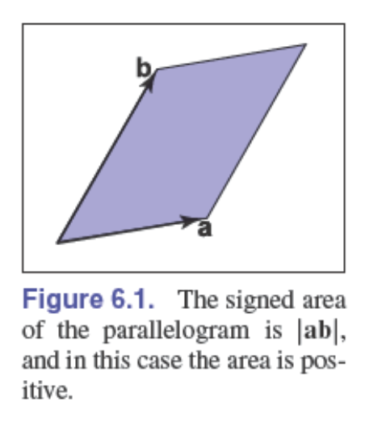
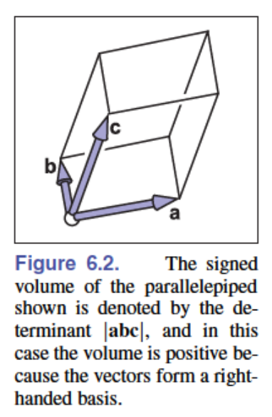
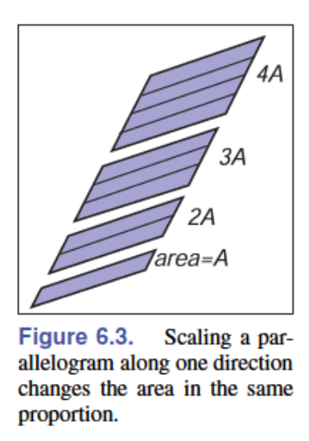
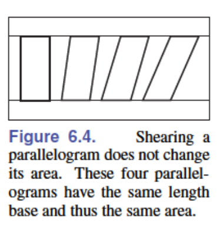
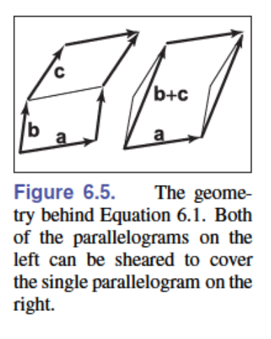
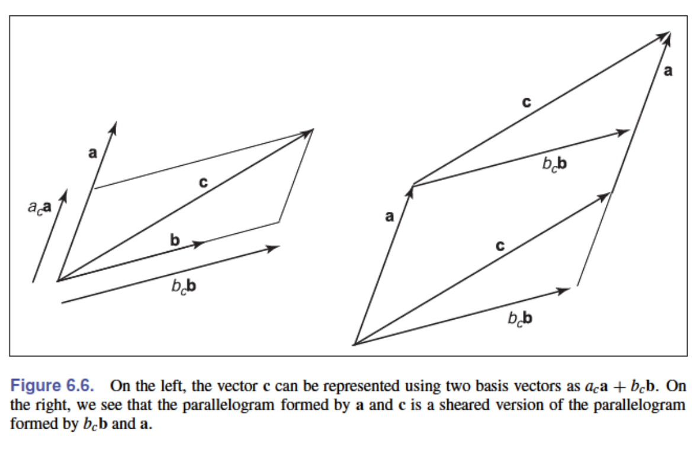

# 6 - 线性代数

也许，图形程序中最通用的工具是那些用于改变或变换点和向量的矩阵。在下一章中，我们将看到如何将向量表示为单列矩阵，以及如何通过与方形矩阵相乘来在不同基底下表示向量。我们还将描述如何使用这种矩阵乘法来实现向量的变换，如缩放、旋转和平移。在本章中，我们从几何角度回顾基础线性代数，重点关注在二维和三维情况下运行良好的直觉理解和算法。

对线性代数已经熟悉的读者可以跳过本章。然而，即使对于这样的读者，可能也会发现一些有启发性的内容，例如行列式的推导以及奇异值分解和特征值分解的讨论。

## 6.1 行列式

我们通常认为行列式产生于线性方程组的求解过程中。然而，对于我们的目的，我们将行列式视为向量相乘的另一种方式。对于二维向量 $\mathbf{a}$ 和 $\mathbf{b}$，行列式 $|\mathbf{a}\mathbf{b}|$ 是由 $\mathbf{a}$ 和 $\mathbf{b}$ 构成的平行四边形的面积（图6.1）。这是一个有向面积，如果 $\mathbf{a}$ 和 $\mathbf{b}$ 构成右手系，则符号为正；如果构成左手系，则符号为负。这意味着 $|\mathbf{a}\mathbf{b}| = -|\mathbf{b}\mathbf{a}|$。在二维情况下，我们可以将"右手系"理解为逆时针旋转第一个向量至与第二个向量形成的最小角度。

在三维情况下，行列式必须一次考虑三个向量。对于三个三维向量 $\mathbf{a}$、$\mathbf{b}$ 和 $\mathbf{c}$，行列式 $|\mathbf{a}\mathbf{b}\mathbf{c}|$ 是由这三个向量构成的平行六面体（三维平行四边形；一个剪切的三维盒子）的有向体积（图6.2）。

要计算二维行列式，我们首先需要建立它的几个性质。我们注意到，缩放平行四边形的一边会按相同比例缩放其面积（图6.3）：

$$|(k\mathbf{a})\mathbf{b}| = |\mathbf{a}(k\mathbf{b})| = k|\mathbf{a}\mathbf{b}|$$

同样，我们注意到"剪切"平行四边形不会改变其面积（图6.4）：

$$|(\mathbf{a} + k\mathbf{b})\mathbf{b}| = |\mathbf{a}(\mathbf{b} + k\mathbf{a})| = |\mathbf{a}\mathbf{b}|$$

最后，我们看到行列式具有以下性质：

$$|\mathbf{a}(\mathbf{b} + \mathbf{c})| = |\mathbf{a}\mathbf{b}| + |\mathbf{a}\mathbf{c}| \tag{6.1}$$

这是因为如图6.5所示，我们可以将两个平行四边形之间的边"滑动"过去形成一个单一的平行四边形，而不改变原来两个平行四边形中任何一个的面积。

现在让我们假设 $\mathbf{a}$ 和 $\mathbf{b}$ 的笛卡尔表示：

$$|\mathbf{a}\mathbf{b}| = |(x_a\mathbf{x} + y_a\mathbf{y})(x_b\mathbf{x} + y_b\mathbf{y})|$$

$$= x_ax_b|\mathbf{x}\mathbf{x}| + x_ay_b|\mathbf{x}\mathbf{y}| + y_ax_b|\mathbf{y}\mathbf{x}| + y_ay_b|\mathbf{y}\mathbf{y}|$$

$$= x_ax_b(0) + x_ay_b(+1) + y_ax_b(-1) + y_ay_b(0)$$

$$= x_ay_b - y_ax_b$$

这个简化过程利用了对于任何向量 $\mathbf{v}$，都有 $|\mathbf{v}\mathbf{v}| = 0$ 这一事实，因为平行四边形将与 $\mathbf{v}$ 共线，因此没有面积。

在三维情况下，三个三维向量 $\mathbf{a}$、$\mathbf{b}$ 和 $\mathbf{c}$ 的行列式记作 $|\mathbf{a}\mathbf{b}\mathbf{c}|$。使用向量的笛卡尔表示，平行六面体具有与平行四边形类似的规则，我们可以进行与二维情况类似的展开：

$$|\mathbf{a}\mathbf{b}\mathbf{c}| = |(x_a\mathbf{x} + y_a\mathbf{y} + z_a\mathbf{z})(x_b\mathbf{x} + y_b\mathbf{y} + z_b\mathbf{z})(x_c\mathbf{x} + y_c\mathbf{y} + z_c\mathbf{z})|$$

$$= x_ay_bz_c - x_az_by_c - y_ax_bz_c + y_az_bx_c + z_ax_by_c - z_ay_bx_c$$

正如你所看到的，随着维数的增加，用这种方式计算行列式变得越来越复杂。我们将在第6.3节中讨论计算行列式的更加不易出错的方法。

**例题 2** 当计算将一个向量表示为另外两个向量的线性组合时，行列式自然地出现了——例如，如果我们希望将向量 $\vec{c}$ 表示为向量 $\vec{a}$ 和 $\vec{b}$ 的组合：

$$\vec{c} = \mathbf{a}_c\vec{a} + \mathbf{b}_c\vec{b}$$

从图6.6中我们可以看出：

$$|(\mathbf{b}_c\vec{b})\vec{a}| = |\vec{c}\vec{a}|$$

因为这些平行四边形只是彼此的剪切版本。解出 $\mathbf{b}_c$ 得到：

$$\mathbf{b}_c = \frac{|\vec{c}\vec{a}|}{|\vec{b}\vec{a}|}$$

类似的论证可以得到：

$$\mathbf{a}_c = \frac{|\vec{b}\vec{c}|}{|\vec{b}\vec{a}|}$$

这是克拉默法则的二维版本，我们将在第6.3.2节中重新讨论。

## 6.2 矩阵

矩阵是遵循特定算术规则的数值元素数组。一个具有两行三列的矩阵示例如下：

$$\begin{bmatrix}
1.7 & -1.2 & 4.2 \\
3.0 & 4.5 & -7.2
\end{bmatrix}$$

矩阵在计算机图形学中被广泛用于多种用途，包括空间变换的表示。在我们的讨论中，我们假设矩阵的所有元素都是实数。本章将描述矩阵运算的机制以及"方阵"（即行数与列数相等的矩阵）的行列式计算。

### 6.2.1 矩阵运算

矩阵乘以常数会得到一个新矩阵，其中每个元素都乘以该常数，例如：

$$2 \begin{bmatrix}
1 & -4 \\
3 & 2
\end{bmatrix} = \begin{bmatrix}
2 & -8 \\
6 & 4
\end{bmatrix}$$

对于矩阵乘法，我们将第一个矩阵的"行"与第二个矩阵的"列"相乘：

$$\begin{bmatrix}
a_{11} & \cdots & a_{1m} \\
\vdots & \ddots & \vdots \\
a_{i1} & \cdots & a_{im} \\
\vdots & \ddots & \vdots \\
a_{r1} & \cdots & a_{rm}
\end{bmatrix}
\begin{bmatrix}
b_{11} & \cdots & b_{1j} & \cdots & b_{1c} \\
\vdots & \ddots & \vdots & \ddots & \vdots \\
b_{m1} & \cdots & b_{mj} & \cdots & b_{mc}
\end{bmatrix} =
\begin{bmatrix}
p_{11} & \cdots & p_{1j} & \cdots & p_{1c} \\
\vdots & \ddots & \vdots & \ddots & \vdots \\
p_{i1} & \cdots & p_{ij} & \cdots & p_{ic} \\
\vdots & \ddots & \vdots & \ddots & \vdots \\
p_{r1} & \cdots & p_{rj} & \cdots & p_{rc}
\end{bmatrix}$$

因此，结果矩阵中元素$p_{ij}$为：

$$p_{ij} = a_{i1}b_{1j} + a_{i2}b_{2j} + \cdots + a_{im}b_{mj} \tag{6.2}$$

只有当左矩阵的列数与右矩阵的行数相等时，两个矩阵的乘法才可能进行。

矩阵乘法在大多数情况下不满足交换律：

$$\mathbf{A}\mathbf{B} \neq \mathbf{B}\mathbf{A} \tag{6.3}$$

同时，如果$\mathbf{A}\mathbf{B} = \mathbf{A}\mathbf{C}$，也不一定意味着$\mathbf{B} = \mathbf{C}$。幸运的是，矩阵乘法满足结合律和分配律：

$$(\mathbf{A}\mathbf{B})\mathbf{C} = \mathbf{A}(\mathbf{B}\mathbf{C})$$

$$\mathbf{A}(\mathbf{B} + \mathbf{C}) = \mathbf{A}\mathbf{B} + \mathbf{A}\mathbf{C}$$

$$(\mathbf{A} + \mathbf{B})\mathbf{C} = \mathbf{A}\mathbf{C} + \mathbf{B}\mathbf{C}$$

### 6.2.2 矩阵运算

我们希望找到矩阵的逆，类似于实数的倒数。我们知道实数$x$的倒数是$1/x$，且$x$与其倒数的乘积为1。我们需要一个矩阵$\mathbf{I}$，可以将其视为"矩阵中的1"。这只对方阵存在，被称为单位矩阵；它由对角线上的1和其他位置的0组成。例如，四阶单位矩阵为：

$$\mathbf{I} = \begin{bmatrix}
1 & 0 & 0 & 0 \\
0 & 1 & 0 & 0 \\
0 & 0 & 1 & 0 \\
0 & 0 & 0 & 1
\end{bmatrix}$$

矩阵$\mathbf{A}$的逆矩阵$\mathbf{A}^{-1}$是确保$\mathbf{A}\mathbf{A}^{-1} = \mathbf{I}$的矩阵。

例如：
$$\begin{bmatrix}
1 & 2 \\
3 & 4
\end{bmatrix}^{-1} = \begin{bmatrix}
-2.0 & 1.0 \\
1.5 & -0.5
\end{bmatrix}$$

因为：
$$\begin{bmatrix}
1 & 2 \\
3 & 4
\end{bmatrix} \begin{bmatrix}
-2.0 & 1.0 \\
1.5 & -0.5
\end{bmatrix} = \begin{bmatrix}
1 & 0 \\
0 & 1
\end{bmatrix}$$

注意$\mathbf{A}^{-1}$的逆矩阵是$\mathbf{A}$。因此$\mathbf{A}\mathbf{A}^{-1} = \mathbf{A}^{-1}\mathbf{A} = \mathbf{I}$。两个矩阵乘积的逆等于各自逆矩阵的乘积，但顺序颠倒：

$$(\mathbf{A}\mathbf{B})^{-1} = \mathbf{B}^{-1}\mathbf{A}^{-1}\tag{6.4}$$

我们将在6.3节中回到计算逆矩阵的问题。

矩阵$\mathbf{A}$的转置$\mathbf{A}^T$具有相同的数值，但行与列互换。如果我们将$\mathbf{A}^T$的元素标记为$a'_{ij}$，那么：

$$a_{ij} = a'_{ji}$$

例如：
$$\begin{bmatrix}
1 & 2 \\
3 & 4 \\
5 & 6
\end{bmatrix}^T = \begin{bmatrix}
1 & 3 & 5 \\
2 & 4 & 6
\end{bmatrix}$$

两个矩阵乘积的转置遵循类似于公式(6.4)的规则：

$$(\mathbf{A}\mathbf{B})^T = \mathbf{B}^T\mathbf{A}^T$$

方阵的行列式就是将矩阵的列视为向量集合时的行列式。行列式与刚刚讨论的矩阵运算有几个很好的关系，我们在此列出以供参考：

$$|\mathbf{A}\mathbf{B}| = |\mathbf{A}||\mathbf{B}| \tag{6.5}$$

$$\left|\mathbf{A}^{-1}\right| = \frac{1}{|\mathbf{A}|} \tag{6.6}$$

$$\left|\mathbf{A}^T\right| = |\mathbf{A}| \tag{6.7}$$

### 6.2.3 向量运算的矩阵形式

在图形学中，我们使用方阵来变换以矩阵形式表示的向量。例如，如果你有一个2D向量$\vec{a} = (x_a, y_a)$，想要将其绕原点逆时针旋转90度形成向量$\vec{a}' = (-y_a, x_a)$，你可以使用一个$2 \times 2$矩阵与一个$2 \times 1$矩阵（称为列向量）的乘积。矩阵形式的运算为：

$$\begin{bmatrix}
0 & -1 \\
1 & 0
\end{bmatrix} \begin{bmatrix}
x_a \\
y_a
\end{bmatrix} = \begin{bmatrix}
-y_a \\
x_a
\end{bmatrix}$$

我们也可以通过使用该矩阵的转置，并用行向量在左侧相乘（"前乘"）来获得相同的结果：

$$\begin{bmatrix}
x_a & y_a
\end{bmatrix} \begin{bmatrix}
0 & 1 \\
-1 & 0
\end{bmatrix} = \begin{bmatrix}
-y_a & x_a
\end{bmatrix}$$

如今，使用列向量的后乘法已经相当标准，但在许多较旧的书籍和系统中，你会遇到行向量和前乘法。唯一的区别是变换矩阵必须替换为其转置。

我们还可以使用矩阵形式来编码仅对向量的运算。如果我们将点积的结果视为$1 \times 1$矩阵，则可以写成：

$$\vec{a} \cdot \vec{b} = \vec{a}^T\vec{b}$$